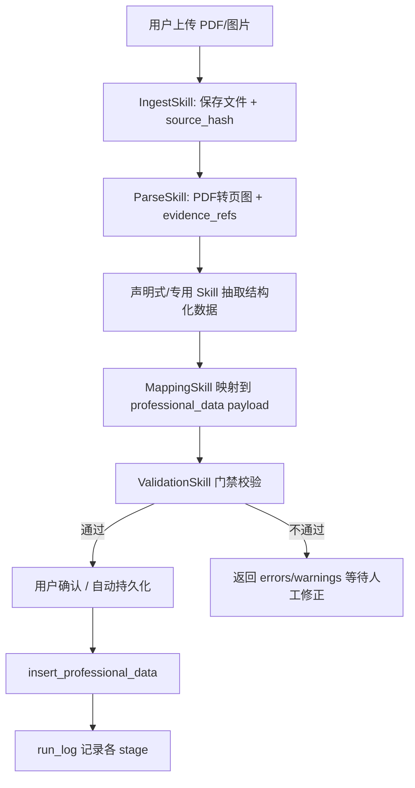
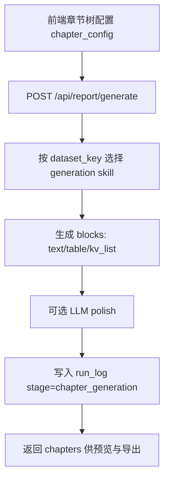

# AutoRe 工程级 PRD（垂直领域 Agent）

## 1. 文档信息
| 项 | 内容 |
|---|---|
| 文档名称 | AutoRe 工程级 PRD |
| 版本 | v1.0-draft |
| 状态 | Draft（MVP视图：仅展示当前启用节点/字段） |
| 更新时间 | 2026-02-27 |
| 面向对象 | 产品、后端、前端、算法、测试、运维 |
| 代码基线 | `Reportplatformautore_skills` 仓库实现 |

> 二期治理与扩展内容已迁移至：`PRD_AutoRe_Phase2.md`

## 2. 产品定位与目标
### 2.1 产品定位
AutoRe 是面向房屋检测/危房鉴定场景的垂直 Agent 平台，核心能力是将检测资料（PDF/图片/结构化结果）转为可审计的专业数据，再自动生成报告章节。

### 2.2 核心目标
1. 建立 Prompt/Skill 资产化研发体系，而非纯字段堆砌。
2. 保障数据可追溯：每条专业数据都可回溯 source file + page。
3. 保障生产可运维：版本化、灰度、回滚、评测与审计闭环。
4. 支持新增检测类型与报告模板的低成本扩展。

### 2.3 核心原则
1. Prompt 驱动业务能力。
2. Schema 驱动系统稳定性。
3. Validation 驱动落库门禁。
4. Run Log 驱动可观测与审计。

## 3. 范围定义
### 3.1 本期范围（In Scope）
1. 数据采集与解析：上传、解析、声明式 Skill 执行、确认入库。
2. 专业数据存储：`professional_data` 与 `run_log`。
3. 报告章节生成：按 `dataset_key` 调用 generation skills。
4. 技能编排：单文件手动技能执行（MVP 必做）。
5. 模板与规则：`template_registry` + mapping/validation rules。

### 3.2 MVP 第一版必做（P1 Must）
1. 采集闭环：`upload -> skill run -> confirm -> professional_data`。
2. 报告闭环：`report/generate` 可生成可预览章节。
3. 最小审计：`run_log` 记录关键阶段（ingest/parse/mapping/validation/persist/chapter_generation）。
4. 关键契约冻结：系统层字段 + 核心接口输入输出。
5. 字段分层底线：Layer 1 仅存原始抽取 JSON，Layer 2 至少落最小核心独立列（可查询/可统计）。

### 3.3 MVP 当前启用节点与配置项（报告编辑模块）
1. 本节仅描述“报告编辑/章节生成”模块，不包含采集链路中的节点与配置。
2. 章节节点类型：`report`（报告章节节点）。
3. 章节编辑可见字段：`label`、`templateStyle`（单下拉“检测大类/数据用途”）。
4. 内部字段说明：`sourceNodeId` 由“检测大类/数据用途”单下拉（`templateStyle`）自动映射写回（非手动输入，不再单独配置“检测大类”）；`chapterNumber` 作为内部排序字段保留（UI 隐藏）。
5. 章节生成映射表（`templateStyle` -> `sourceNodeId` -> `dataset_key`）：

| UI中文（单下拉） | templateStyle | sourceNodeId | dataset_key | 说明 |
|---|---|---|---|---|
| 混凝土强度检测 | `concrete_strength_full` | `scope_concrete_strength` | `concrete_strength_comprehensive` | 混凝土综合章节 |
| 混凝土强度表格（旧） | `concrete_strength_table` | `scope_concrete_strength` | `concrete_strength` | 兼容旧配置 |
| 混凝土强度描述（旧） | `concrete_strength_desc` | `scope_concrete_strength` | `concrete_strength` | 兼容旧配置 |
| 砂浆强度（表格+描述） | `mortar_strength_data` | `scope_mortar_strength` | `mortar_strength` | 砂浆章节 |
| 砖强度（表格+描述） | `brick_strength_table` | `scope_brick_strength` | `brick_strength` | 砖章节 |
| 基本情况 | `basic_situation` | `scope_basic_situation` | `basic_situation` | 基础信息章节 |
| 房屋概况 | `house_overview` | `scope_house_overview` | `house_overview` | 房屋概况章节 |
| 鉴定内容和方法及原始记录一览表 | `inspection_content_and_methods` | `scope_inspection_content_and_methods` | `inspection_content_and_methods` | 检测内容章节 |
| 检测鉴定依据 | `inspection_basis` | `scope_inspection_basis` | `inspection_basis` | 依据章节 |
| 详细检查情况 | `detailed_inspection` | `scope_detailed_inspection` | `detailed_inspection` | 现状检查章节 |
| 荷载及计算参数取值 | `load_calc_params` | `scope_load_calc_params` | `load_calc_params` | 荷载参数章节 |
| 承载能力复核验算 | `bearing_capacity_review` | `scope_bearing_capacity_review` | `bearing_capacity_review` | 复核验算章节 |
| 分析说明（静态） | `analysis_explanation` | `scope_analysis_explanation` | `analysis_explanation` | 静态模板章节 |
| 鉴定意见及处理建议（静态） | `opinion_and_suggestions` | `scope_opinion_and_suggestions` | `opinion_and_suggestions` | 静态模板章节 |

### 3.4 非目标（Out of Scope）
1. 多租户隔离与商业计费。
2. 外部开放 API 产品化（鉴权套餐、SLA 合同化）。
3. 复杂权限中心（RBAC/ABAC 全量实现）。

## 4. 角色与典型场景
| 角色 | 核心诉求 | 关键操作 |
|---|---|---|
| 检测工程师 | 快速抽取资料并纠错 | 上传文件、选择 skill、编辑 JSON、确认入库 |
| 报告工程师 | 生成可交付章节 | 配置章节树、绑定数据范围、生成报告 |
| 项目管理员 | 控制质量与回滚风险 | 管理模板版本、查看 run log、处理失败任务 |
| 开发/算法 | 快速迭代新 skill | 新增 skill、更新 prompt、发布与回滚 |

## 5. 业务流程（端到端）
### 5.1 数据采集与入库主流程


### 5.3 报告生成流程


## 6. 系统架构
### 6.1 技术栈
| 层 | 技术 |
|---|---|
| 前端 | React + TypeScript + Vite + ReactFlow |
| 后端 | FastAPI + SQLAlchemy |
| 存储 | SQLite/PostgreSQL（代码同时支持）+ 本地文件存储 |
| 解析 | pdf2image + Pillow + Poppler |
| LLM网关 | OpenAI/SiliconFlow/Moonshot/Qwen 统一封装 |
| Skill运行 | DeclarativeSkillExecutor + ScriptRunner |

### 6.2 核心组件
1. API 层：`backend/api/*.py`
2. Skill 层：命令式 skills + 声明式 skills + generation skills
3. 数据层：`professional_data`、`run_log`、`template_registry`
4. 编排层：`SkillOrchestrator`、`SkillRegistry`
5. LLM Gateway：统一多模型调用

## 7. Skills 体系（工程化定义）
### 7.1 Skill 分类
| 类型 | 代表技能 | 职责 |
|---|---|---|
| Imperative | `ingest` `parse` `mapping` `validation` `template_profile` | 通用稳定流程能力 |
| Declarative（信息采集） | `concrete_table_recognition` `mortar_table_recognition` `brick_table_recognition` `delegate_info_recognition` `software_calculation_recognition` | 垂直提取与结构化 |
| Generation（章节） | `basic_situation` `house_overview` `inspection_content_and_methods` `inspection_basis` `detailed_inspection` `load_calc_params` `bearing_capacity_review` `analysis_explanation` `opinion_and_suggestions` | 报告章节生成 |

### 7.2 Skill 工程模板（必须项）
每个 skill 必须在 PRD/注册信息中明确：
| 项 | 说明 |
|---|---|
| skill_id | 唯一标识（建议与目录名一致） |
| input_schema | JSON Schema（请求输入契约） |
| output_schema | JSON Schema（输出契约） |
| prompt_path | Prompt 文件路径 |
| script_path | 脚本入口（可选） |
| schema_version | 输出 schema 版本 |
| prompt_version | prompt 版本 |
| retry_policy | 重试策略 |
| rollback_policy | 回滚策略 |
| gray_release | 是否支持灰度 |
| owner | 责任人 |

### 7.3 章节生成策略（dataset_key）
| dataset_key | 章节能力 |
|---|---|
| `concrete_strength` / `concrete_strength_comprehensive` | 混凝土强度数据与描述 |
| `brick_strength` | 砖强度章节 |
| `mortar_strength` | 砂浆强度章节 |
| `basic_situation` | 基本情况 |
| `house_overview` | 房屋概况 |
| `inspection_content_and_methods` | 鉴定内容/方法/原始记录 |
| `inspection_basis` | 检测鉴定依据 |
| `detailed_inspection` | 详细检查情况 |
| `load_calc_params` | 荷载及计算参数取值 |
| `bearing_capacity_review` | 承载能力复核验算 |
| `analysis_explanation` | 分析说明（当前静态模板） |
| `opinion_and_suggestions` | 鉴定意见与建议（当前静态模板） |

## 8. 数据契约与字段定义
### 8.1 系统层锁定字段（不可随意改动）
以下字段属于系统稳定层，必须冻结契约：
1. `project_id`
2. `node_id`
3. `test_item`
4. `raw_result`
5. `confirmed_result`
6. `result_version`
7. `input_fingerprint`
8. `source_hash`
9. `source_prompt_version`
10. `schema_version`
11. `evidence_refs`
12. `run_id`

### 8.2 `professional_data` 字段（核心业务表）
#### 8.2.1 三层字段库定义（硬约束）
1. Layer 1（原始抽取层）：
   - 存储方式：`json/jsonb`。
   - 当前字段：`raw_result`、`test_value_json`。
   - 目标：保留原始抽取上下文，支持追溯与重放。
2. Layer 2（核心业务字段层）：
   - 存储方式：数据库独立列（column）。
   - 目标：支撑规则计算、筛选、聚合统计、跨节点关联。
   - 硬约束：禁止将 Layer 2 整体回塞为单个 `json/jsonb` 字段（如 `layer2_value jsonb`）。
3. Layer 3（规则结果层）：
   - 存储方式：数据库独立列（column）。
   - 目标：沉淀可审计的判定结果，支持横向统计与复核。

#### 8.2.2 列化判断标准（Columnization Gate）
满足以下任一条件的字段，必须设计为独立列，而非仅放在 JSON 中：
1. 需要 `WHERE` 筛选。
2. 需要 `JOIN` 关联。
3. 需要 `AVG/SUM/COUNT` 等聚合统计。
4. 需要 `ORDER BY` 排序。
5. 需要建立索引提升查询性能。

#### 8.2.3 当前字段分层（与现有代码基线对齐）
| 层级 | 存储方式 | 当前字段示例 | 说明 |
|---|---|---|---|
| Layer 1 原始抽取 | json/jsonb | `raw_result`, `test_value_json` | 保留原始模型输出/解析结果 |
| Layer 2 核心字段 | 独立列 | `project_id`, `node_id`, `test_item`, `test_result`, `test_unit`, `record_code`, `test_date`, `component_type`, `input_fingerprint` | 可查询、可统计、可索引 |
| Layer 3 规则结果 | 独立列 | `result_version`, `confidence`（当前）；`is_qualified`, `risk_level`（建议新增） | 判定与质量结果沉淀 |

#### 8.2.4 字段清单（当前实现）
| 字段 | 类型 | 说明 |
|---|---|---|
| id | text/uuid | 主键 |
| project_id, node_id | text | 项目/节点范围 |
| run_id | text/uuid | 关联运行ID |
| test_item | text | 检测项目 |
| test_result, test_unit | number/text | 主数值结果 |
| record_code | text | 原始记录编号 |
| test_location_text | text | 检测部位 |
| design_strength_grade | text | 设计强度等级 |
| strength_estimated_mpa | number | 强度推定值 |
| carbonation_depth_avg_mm | number | 碳化深度平均值 |
| test_date, casting_date | date/text | 日期信息 |
| test_value_json | json | 结构化扩展字段 |
| component_type/location | text/json | 构件与定位 |
| evidence_refs | json array | 证据链 |
| raw_result | json | 抽取原始结果 |
| confirmed_result | json | 人工确认结果 |
| result_version | int | 结果版本 |
| source_prompt_version | text | 来源prompt版本 |
| schema_version | text | schema版本 |
| raw_hash/input_fingerprint | text | 去重与完整性 |
| confidence | number | 置信度 |
| created_at | timestamp | 创建时间 |

### 8.3 `run_log` 字段（审计表）
| 字段 | 说明 |
|---|---|
| run_id | 运行主键（或业务主键） |
| project_id/node_id | 业务范围 |
| stage | ingest/parse/mapping/validation/persist/commit/chapter_generation/... |
| status | SUCCESS/FAILED/RUNNING |
| prompt_version/schema_version | 版本信息 |
| input_file_hashes | 输入哈希 |
| skill_steps | 步骤明细 |
| llm_usage | token/模型统计 |
| total_cost | 成本 |
| error_message | 错误原因 |

### 8.4 模板表 `template_registry`
| 字段 | 说明 |
|---|---|
| template_id | 模板ID |
| dataset_key | 数据集键 |
| fingerprint | 表头指纹 |
| schema_version | 映射schema版本 |
| prompt_version | prompt版本 |
| prompt | 抽取prompt正文 |
| mapping_rules | 映射规则 |
| validation_rules | 校验规则 |
| status | active/draft/deprecated |

## 9. API 规范（当前实现）
### 9.1 基础接口
| 方法 | 路径 | 说明 |
|---|---|---|
| GET | `/` | 服务信息 |
| GET | `/health` | 健康检查 |
| GET | `/api/run/{run_id}` | 运行状态（占位实现） |

### 9.2 采集与确认
| 方法 | 路径 | 说明 |
|---|---|---|
| POST | `/api/collection/upload` | 上传并可选自动解析/映射/校验/持久化 |
| POST | `/api/collection/confirm` | 对 mapped_payload 做最终校验并落库 |

`/api/collection/upload` 关键入参（multipart）：
1. `file`
2. `project_id`
3. `node_id`
4. `node_label`（可选）
5. `prompt`（可选）
6. `template_id`（可选）
7. `auto_parse` `use_llm` `persist_result`

### 9.3 声明式技能接口
| 方法 | 路径 | 说明 |
|---|---|---|
| POST | `/api/skill/execute` | 通用声明式技能执行 |
| POST | `/api/skill/{skill_name}/run` | 对指定 skill 运行上传文件 |
| POST | `/api/skill/{skill_name}/diagnose` | 诊断模式 |
| POST | `/api/skill/confirm` | 人工确认后批量落库 |
| GET | `/api/skills/list` | 列出可用技能 |
| GET | `/api/skill/{skill_name}/info` | 技能详情 |

### 9.4 报告生成接口
| 方法 | 路径 | 说明 |
|---|---|---|
| POST | `/api/report/generate` | 根据 `chapter_config.dataset_key` 生成章节 blocks |

`GenerateReportRequest`：
1. `project_id`
2. `chapter_config`
3. `project_context`

## 10. 可观测性与审计
### 10.1 必记录字段
1. `run_id`
2. `skill_name/stage`
3. `provider/model`
4. `prompt_version/schema_version`
5. `input_fingerprint/source_hash`
6. `status/error_message`
7. `llm_usage/total_cost`

### 10.2 运行阶段建议标准化
`ingest` `parse` `template_resolve` `mapping` `validation` `persist` `commit` `declarative_skill` `orchestrated_skill` `chapter_generation` `exception`

## 11. 非功能需求
| 维度 | 要求 |
|---|---|
| 可用性 | 上传、解析、章节生成链路可重试 |
| 性能 | 单文件 50MB 内可处理；大批量走编排接口 |
| 可扩展性 | 新 skill 通过 `skills_library` 注册，无需改主流程 |
| 可维护性 | Prompt/Schema/规则版本化 + 回滚 |
| 安全性 | 文件类型白名单、大小限制、错误隔离 |

## 12. 当前实现差距与风险（As-Is）
1. SQLite 初始化脚本未包含 `template_registry`，与模板解析流程存在环境差异风险。
2. `run_log` 在 SQLite/PostgreSQL 的主键结构不一致，插入返回字段策略需统一。
3. Prompt 目前主要托管在 `template_registry`，缺少独立 `prompt_registry` 与灰度字段。
4. `analysis_explanation` 与 `opinion_and_suggestions` 当前为静态模板，需后续动态化。

## 13. 分阶段实施计划
### Phase A（立即落地）
1. 固化本 PRD 的系统层字段与 API 契约。
2. 统一 `run_log` 数据结构（SQLite/PostgreSQL 一致化）。
3. 建立 prompt/schema 发布与回滚操作手册。

## 14. MVP 决策清单（已拍板）
### 14.1 决策状态说明
| 状态 | 说明 |
|---|---|
| Decided | 已拍板 |

### 14.2 核心业务与组织决策
| 决策ID | 主题 | 选项 | 影响 | 建议默认项 | 当前状态 | 负责人 | 截止日期 | 最终决策 |
|---|---|---|---|---|---|---|---|---|
| DEC-001 | 报告类型优先级与规范映射（民标/工标/危房） | `A.先危房后民标` `B.先民标后危房` `C.双线并行` | 决定章节模板优先建设顺序和数据字段优先级 | `A` | Decided | 产品负责人 | 2026-02-27 | 采用 `A`：MVP先聚焦危房鉴定主链路，民标与工标后续扩展 |
| DEC-002 | Skill 责任人与发布审批链 | `A.技能Owner+技术Owner双签` `B.单Owner审批` `C.委员会审批` | 影响发布效率与质量门禁强度 | `A` | Decided | 技术负责人 | 2026-02-27 | 采用 `A`：Skill Owner 负责业务正确性，Tech Owner 负责工程质量与回滚 |
| DEC-003 | 线上时延 SLA（单任务） | `A.P50<=30s/P95<=120s` `B.P50<=60s/P95<=180s` `C.仅定义P95<=300s` | 影响模型选择、并发配置、用户体验预期 | `B` | Decided | 后端负责人 | 2026-02-27 | 采用 `B`：MVP阶段平衡稳定性与交付速度，先保证可用再逐步优化 |

### 14.3 环境与配置治理决策
| 决策ID | 主题 | 选项 | 影响 | 建议默认项 | 当前状态 | 负责人 | 截止日期 | 最终决策 |
|---|---|---|---|---|---|---|---|---|
| DEC-007 | Prompt/Template 多环境隔离策略 | `A.dev/staging/prod 完全隔离` `B.dev与staging共享/prod隔离` `C.单库多状态` | 影响回滚安全性与配置管理复杂度 | `A` | Decided | 平台负责人 | 2026-02-27 | 采用 `A`：生产环境与开发/测试完全隔离，禁止跨环境复用活动版本 |

### 14.4 决策会议输出模板
```markdown
- 决策ID:
- 结论:
- 采用原因:
- 放弃原因:
- 生效版本:
- 关联变更(文档/代码/配置):
- 风险与缓解措施:
```

### 14.5 MVP 执行边界说明
1. DEC-001、DEC-002、DEC-003、DEC-007 为 MVP 已拍板基线，按既定结论直接执行，不再阻塞研发。
2. 若发生线上事故或交付风险，可优先回到已拍板基线，避免临时扩大范围。

## 15. 附录 A：关键 JSON Schema（当前）
### 15.1 `professional_data.json`（摘要）
- required: `test_item`, `test_result`, `test_unit`, `evidence_refs`
- 关键属性: `component_type`, `location`, `source_hash`, `confidence`

### 15.2 `evidence_ref.json`（摘要）
- required: `object_key`, `type`, `page`, `source_hash`
- `type` 枚举: `pdf`, `image`, `excel`

## 16. 附录 B：前端主交互
1. 采集编辑器：上传文件、选择 skill、执行解析、编辑 JSON、确认落库。
2. 报告编辑器：配置章节树、绑定 `sourceNodeId/scope_*`、调用 `/api/report/generate`。
3. 技能选择器：`/api/skills/list` + `/api/skill/{skill_name}/info`。

## 17. 附录 C：API 接口级契约（v1）
> 说明：本附录用于前后端联调、自动化测试与版本回滚，不替代业务说明。  

### 17.1 `POST /api/report/generate`
Request Schema：
```json
{
  "type": "object",
  "required": ["project_id", "chapter_config", "project_context"],
  "properties": {
    "project_id": { "type": "string" },
    "chapter_config": {
      "type": "object",
      "required": ["dataset_key"],
      "properties": {
        "node_id": { "type": "string" },
        "chapter_id": { "type": "string" },
        "title": { "type": "string" },
        "dataset_key": { "type": "string" },
        "sourceNodeId": { "type": "string" },
        "source_node_id": { "type": "string" },
        "use_llm": { "type": "boolean" },
        "context": { "type": "object" }
      }
    },
    "project_context": { "type": "object" }
  }
}
```

Response Schema：
```json
{
  "type": "object",
  "required": ["report_id", "chapters"],
  "properties": {
    "report_id": { "type": "string" },
    "chapters": {
      "type": "array",
      "items": {
        "type": "object",
        "required": ["chapter_id", "title", "chapter_content"],
        "properties": {
          "chapter_id": { "type": "string" },
          "title": { "type": "string" },
          "chapter_content": {
            "type": "object",
            "required": ["blocks"],
            "properties": {
              "blocks": {
                "type": "array",
                "items": {
                  "type": "object",
                  "required": ["type"],
                  "properties": {
                    "type": { "type": "string", "enum": ["text", "table", "kv_list", "note"] },
                    "text": { "type": "string" },
                    "title": { "type": "string" },
                    "items": { "type": "array" },
                    "columns": { "type": "array" },
                    "rows": { "type": "array" },
                    "header_rows": { "type": "array" },
                    "body_rows": { "type": "array" },
                    "facts": { "type": "object" }
                  }
                }
              }
            }
          },
          "summary": { "type": "object" },
          "evidence_refs": { "type": "array" }
        }
      }
    }
  }
}
```

### 17.2 `POST /api/skill/{skill_name}/run`
Request Schema（multipart/form-data）：
```json
{
  "type": "object",
  "required": ["file"],
  "properties": {
    "file": { "type": "string", "description": "binary file" },
    "format": { "type": "string", "default": "json" },
    "output_dir": { "type": "string" },
    "project_id": { "type": "string" },
    "node_id": { "type": "string" },
    "persist_result": { "type": "boolean", "default": true }
  }
}
```

Response Schema：
```json
{
  "type": "object",
  "required": ["success", "data", "records", "run_id"],
  "properties": {
    "success": { "type": "boolean" },
    "error": { "type": ["string", "null"] },
    "data": { "type": "array" },
    "records": {
      "type": "array",
      "items": {
        "type": "object",
        "required": ["chunk_id", "status", "data"],
        "properties": {
          "chunk_id": { "type": "string" },
          "status": { "type": "string", "enum": ["success", "failed", "skipped"] },
          "record_id": { "type": ["string", "null"] },
          "data": { "type": "object" },
          "error": { "type": ["string", "null"] }
        }
      }
    },
    "metadata": { "type": "object" },
    "script_result": { "type": "object" },
    "run_id": { "type": "string" },
    "source_hash": { "type": ["string", "null"] }
  }
}
```

### 17.3 `POST /api/skill/confirm`
Request Schema：
```json
{
  "type": "object",
  "required": ["project_id", "node_id", "skill_name", "records"],
  "properties": {
    "project_id": { "type": "string" },
    "node_id": { "type": "string" },
    "skill_name": { "type": "string" },
    "run_id": { "type": "string" },
    "source_hash": { "type": "string" },
    "records": {
      "type": "array",
      "items": {
        "anyOf": [
          { "type": "object" },
          {
            "type": "object",
            "required": ["data"],
            "properties": {
              "table_type": { "type": "string" },
              "data": { "type": "object" }
            }
          }
        ]
      }
    }
  }
}
```

Response Schema：
```json
{
  "type": "object",
  "required": ["success", "run_id", "records"],
  "properties": {
    "success": { "type": "boolean" },
    "run_id": { "type": "string" },
    "records": {
      "type": "array",
      "items": {
        "type": "object",
        "required": ["status", "data"],
        "properties": {
          "record_id": { "type": ["string", "null"] },
          "status": { "type": "string", "enum": ["success", "failed"] },
          "data": { "type": "object" }
        }
      }
    }
  }
}
```

### 17.4 通用错误返回（建议统一）
```json
{
  "type": "object",
  "required": ["detail"],
  "properties": {
    "detail": {
      "oneOf": [
        { "type": "string" },
        { "type": "object" }
      ]
    }
  }
}
```

## 18. 附录 D：Skill I/O 契约（开发与测试基线）
### 18.1 Imperative Skills
#### `IngestSkill.execute(upload, project_id)`
Input：
```json
{
  "type": "object",
  "required": ["upload", "project_id"],
  "properties": {
    "upload": { "type": "object", "description": "UploadFile" },
    "project_id": { "type": "string" }
  }
}
```
Output：
```json
{
  "type": "object",
  "required": ["project_id", "object_key", "source_hash", "filename"],
  "properties": {
    "project_id": { "type": "string" },
    "object_key": { "type": "string" },
    "source_hash": { "type": "string" },
    "filename": { "type": "string" }
  }
}
```

#### `ParseSkill.execute(ingest_result, use_llm, prompt)`
Input：
```json
{
  "type": "object",
  "required": ["ingest_result"],
  "properties": {
    "ingest_result": {
      "type": "object",
      "required": ["object_key", "source_hash"]
    },
    "use_llm": { "type": "boolean" },
    "prompt": { "type": "string" }
  }
}
```
Output：
```json
{
  "type": "object",
  "required": ["parse_id", "object_key", "source_hash", "file_type", "page_images", "evidence_refs", "structured_data"],
  "properties": {
    "parse_id": { "type": "string" },
    "object_key": { "type": "string" },
    "source_hash": { "type": "string" },
    "file_type": { "type": "string", "enum": ["pdf", "image"] },
    "page_images": { "type": "array", "items": { "type": "string" } },
    "page_paths": { "type": "array", "items": { "type": "string" } },
    "evidence_refs": { "type": "array" },
    "structured_data": { "type": "object" },
    "llm_usage": { "type": "object" }
  }
}
```

#### `MappingSkill.execute(...)`
Input（摘要）：
```json
{
  "type": "object",
  "required": ["project_id", "node_id", "source_hash", "structured_data"],
  "properties": {
    "project_id": { "type": "string" },
    "node_id": { "type": "string" },
    "source_hash": { "type": "string" },
    "structured_data": {},
    "evidence_refs": { "type": "array" },
    "run_id": { "type": "string" },
    "test_item_override": { "type": "string" },
    "mapping_override": { "type": "object" }
  }
}
```
Output：
```json
{
  "type": "object",
  "required": ["mapped", "meta"],
  "properties": {
    "mapped": {
      "type": "object",
      "required": [
        "project_id", "node_id", "test_item", "evidence_refs", "raw_result",
        "source_prompt_version", "schema_version", "source_hash"
      ]
    },
    "meta": { "type": "object" }
  }
}
```

#### `ValidationSkill.execute(payload, meta)`
Input：
```json
{
  "type": "object",
  "required": ["payload"],
  "properties": {
    "payload": { "type": "object" },
    "meta": { "type": "object" }
  }
}
```
Output：
```json
{
  "type": "object",
  "required": ["is_valid", "errors", "warnings", "normalized", "policy"],
  "properties": {
    "is_valid": { "type": "boolean" },
    "errors": { "type": "array", "items": { "type": "string" } },
    "warnings": { "type": "array", "items": { "type": "string" } },
    "normalized": { "type": "object" },
    "policy": { "type": "object" }
  }
}
```

### 18.2 Declarative Skill Executor（通用）
`DeclarativeSkillExecutor.execute(skill_name, user_input, context, use_llm, use_script, ...)`

Output 契约：
```json
{
  "type": "object",
  "required": ["skill_name", "metadata"],
  "properties": {
    "skill_name": { "type": "string" },
    "llm_response": { "type": ["object", "null"] },
    "script_result": {
      "type": ["object", "null"],
      "properties": {
        "success": { "type": "boolean" },
        "returncode": { "type": "integer" },
        "output": {},
        "stdout": { "type": "string" },
        "stderr": { "type": "string" },
        "error": { "type": "string" }
      }
    },
    "metadata": {
      "type": "object",
      "required": ["name", "description", "version"]
    }
  }
}
```

### 18.3 Generation Skill（章节类）统一输出契约
> 适用于 `dataset_key` 驱动的章节技能返回结构。
```json
{
  "type": "object",
  "properties": {
    "dataset_key": { "type": "string" },
    "chapter_type": { "type": "string" },
    "chapter_title": { "type": "string" },
    "chapter_number": { "type": "string" },
    "content": { "type": "string" },
    "table": { "type": "object" },
    "sections": { "type": "array" },
    "items": { "type": "array" },
    "meta": { "type": "object" },
    "generation_metadata": { "type": "object" },
    "has_data": { "type": "boolean" }
  }
}
```

### 18.4 入库前标准化 Record 契约（建议统一）
```json
{
  "type": "object",
  "required": [
    "project_id", "node_id", "test_item", "evidence_refs",
    "raw_result", "source_prompt_version", "schema_version", "source_hash"
  ],
  "properties": {
    "project_id": { "type": "string" },
    "node_id": { "type": "string" },
    "run_id": { "type": ["string", "null"] },
    "test_item": { "type": "string" },
    "test_result": { "type": ["number", "null"] },
    "test_unit": { "type": ["string", "null"] },
    "record_code": { "type": ["string", "null"] },
    "test_location_text": { "type": ["string", "null"] },
    "design_strength_grade": { "type": ["string", "null"] },
    "strength_estimated_mpa": { "type": ["number", "null"] },
    "carbonation_depth_avg_mm": { "type": ["number", "null"] },
    "test_date": { "type": ["string", "null"] },
    "casting_date": { "type": ["string", "null"] },
    "test_value_json": { "type": ["object", "null"] },
    "component_type": { "type": ["string", "null"] },
    "location": { "type": ["object", "null"] },
    "evidence_refs": { "type": "array" },
    "raw_result": { "type": "object" },
    "confirmed_result": { "type": ["object", "null"] },
    "result_version": { "type": "integer" },
    "source_prompt_version": { "type": "string" },
    "schema_version": { "type": "string" },
    "raw_hash": { "type": ["string", "null"] },
    "input_fingerprint": { "type": ["string", "null"] },
    "source_hash": { "type": "string" },
    "confidence": { "type": ["number", "null"] }
  }
}
```

本 PRD 采用“现状可执行 + 治理可演进”模式，可直接指导开发与后续版本迭代。
