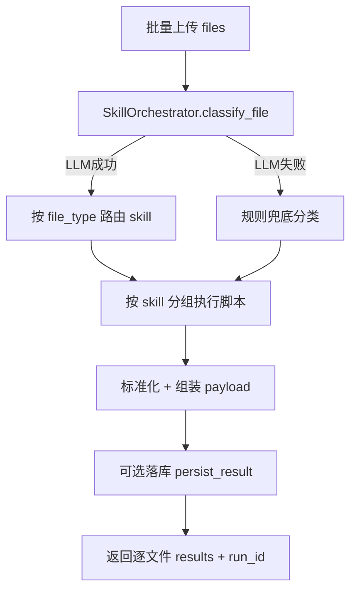

# AutoRe PRD（Phase-2 专项文档）

## 1. 说明
- 文档用途：承接从主 PRD 迁出的二期内容。
- 来源文档：`PRD_AutoRe_Engineering.md`。
- 迁移日期：2026-02-27。
- 适用阶段：MVP 跑通后进入工程治理与能力扩展阶段。

## 2. 迁移内容总览
1. 智能编排批量流程（原 5.2）。
2. `professional_data` 垂直扩展字段（原 8.2.4）。
3. `prompt_registry` 资产表建议（原 8.5）。
4. 采集接口扩展：`/api/ingest/preview`、`/api/ingest/commit`（原 9.2 的 Phase-2 行）。
5. 智能编排接口（原 9.4）。
6. Prompt/Schema 版本治理（原 10）。
7. 质量评测与验收（原 11）。
8. 可观测字段 `output_hash`（原 12.1）。
9. 接口附录：`POST /api/ingest/commit` 契约（原 19.4）。
10. 机器可校验契约资产清单（原 21）。
11. 分阶段计划中的 Phase B / Phase C（原 15）。

## 3. 详细内容
### 3.1 智能编排流程（批量文件）


### 3.2 `professional_data` 推荐扩展字段（垂直高频场景）
1. `table_id`
2. `record_no`
3. `location_text`（若与 `test_location_text` 语义重叠则统一命名）
4. `primary_metric`
5. `primary_value`
6. `primary_unit`
7. `standard_code`
8. `is_qualified`
9. `risk_level`

> 当字段进入“筛选/统计/规则”主链路时，必须列化，不应长期放在 JSON 中。

### 3.3 建议新增 `prompt_registry`
> 当前代码以 `template_registry` 维护 prompt；为满足长期回滚与灰度，建议新增独立 prompt 资产表。

建议结构：
| 字段 | 说明 |
|---|---|
| prompt_id | 主键 |
| skill_id | 归属 skill |
| prompt_version | prompt版本 |
| schema_version | 对应schema版本 |
| prompt_content | prompt内容 |
| prompt_hash | 内容哈希 |
| status | draft/active/deprecated |
| created_at/created_by | 审计字段 |
| rollout_ratio | 灰度比例（可选） |

### 3.4 API 扩展（采集侧）
| 方法 | 路径 | 说明 |
|---|---|---|
| POST | `/api/ingest/preview` | 预解析（手动模板选择前预览） |
| POST | `/api/ingest/commit` | 按选择模板提交抽取与可选落库 |

### 3.5 智能编排接口
| 方法 | 路径 | 说明 |
|---|---|---|
| POST | `/api/skill/orchestrate` | 多文件分类+路由+执行+可选落库 |
| POST | `/api/skill/classify` | 仅文件分类 |

### 3.6 Prompt/Schema 版本治理
#### 3.6.1 发布流程（建议强制）
1. 新建 `prompt_version`（draft）。
2. 绑定 `schema_version`。
3. 通过离线评测（准确率/一致性/结构合法率）。
4. 小流量灰度（例如 5%-20%）。
5. 通过阈值后切 active。
6. 保留旧版可一键回滚。

#### 3.6.2 回滚策略
1. 回滚粒度：按 `skill_id + prompt_version`。
2. 回滚触发：线上错误率、人工投诉率、关键字段漂移超阈值。
3. 回滚要求：不改历史数据，仅影响后续运行。

### 3.7 质量评测与验收
#### 3.7.1 评测维度
1. 结构合法率（JSON Schema pass rate）。
2. 关键字段准确率（`record_code/test_result/test_unit/evidence_refs`）。
3. 证据可追溯率（source_hash + page 完整度）。
4. 报告章节可用率（无空块、表格列完整）。
5. 人工返工率（确认阶段修改比例）。

#### 3.7.2 建议阈值
1. Schema 合法率 >= 99%。
2. 关键字段准确率 >= 95%。
3. 证据可追溯率 >= 99%。
4. 章节生成成功率 >= 98%。

### 3.8 可观测字段补充
- `output_hash`（用于输出漂移监控、回放一致性校验）。

### 3.9 接口附录：`POST /api/ingest/commit`
Request Schema：
```json
{
  "type": "object",
  "required": ["project_id", "node_id", "object_key", "source_hash"],
  "properties": {
    "project_id": { "type": "string" },
    "node_id": { "type": "string" },
    "object_key": { "type": "string" },
    "source_hash": { "type": "string" },
    "filename": { "type": "string" },
    "template_id": { "type": "string" },
    "use_llm": { "type": "boolean", "default": true },
    "persist_result": { "type": "boolean", "default": true },
    "run_id": { "type": "string" },
    "selections": {
      "description": "支持 object 或 array 两种输入",
      "anyOf": [
        { "type": "object" },
        {
          "type": "array",
          "items": {
            "type": "object",
            "required": ["chunk_id", "template_id"],
            "properties": {
              "chunk_id": { "type": "string" },
              "template_id": { "type": "string" },
              "page_range": {
                "type": "array",
                "items": { "type": "integer" }
              }
            }
          }
        }
      ]
    }
  }
}
```

Response Schema：
```json
{
  "type": "object",
  "required": ["run_id", "results"],
  "properties": {
    "run_id": { "type": "string" },
    "results": {
      "type": "array",
      "items": {
        "type": "object",
        "required": ["chunk_id", "template_id", "status"],
        "properties": {
          "chunk_id": { "type": "string" },
          "template_id": { "type": "string" },
          "status": { "type": "string", "enum": ["success", "failed"] },
          "record_id": { "type": ["string", "null"] },
          "inserted_record_ids": { "type": "array" },
          "deduped": { "type": "boolean" },
          "data": { "type": "object" },
          "validation_result": { "type": "object" },
          "error": { "type": "string" }
        }
      }
    }
  }
}
```

### 3.10 机器可校验契约资产清单
#### 3.10.1 API 契约 Schema 文件
1. `backend/schemas/interface/report_generate.request.schema.json`
2. `backend/schemas/interface/report_generate.response.schema.json`
3. `backend/schemas/interface/skill_run.request.schema.json`
4. `backend/schemas/interface/skill_run.response.schema.json`
5. `backend/schemas/interface/skill_confirm.request.schema.json`
6. `backend/schemas/interface/skill_confirm.response.schema.json`
7. `backend/schemas/interface/ingest_commit.request.schema.json`
8. `backend/schemas/interface/ingest_commit.response.schema.json`
9. `backend/schemas/interface/common_error.response.schema.json`

#### 3.10.2 Skill 契约 Schema 文件
1. `backend/schemas/skills/ingest_execute.output.schema.json`
2. `backend/schemas/skills/parse_execute.output.schema.json`
3. `backend/schemas/skills/mapping_execute.output.schema.json`
4. `backend/schemas/skills/validation_execute.output.schema.json`
5. `backend/schemas/skills/declarative_executor.output.schema.json`
6. `backend/schemas/skills/generation_skill.output.schema.json`
7. `backend/schemas/skills/normalized_record.schema.json`

#### 3.10.3 验收模板
1. `INTERFACE_ACCEPTANCE_CHECKLIST.md`

### 3.11 分阶段计划（二期后）
#### Phase B（工程治理）
1. 建立 `prompt_registry` 与灰度开关。
2. 建立离线评测集与自动评测流水线。
3. 增加 `output_hash`、漂移监控与告警。

#### Phase C（能力扩展）
1. 扩展新检测 skill（钢筋、沉降、危房评级等）。
2. 章节策略模块化（多模板/多规范并行）。
3. 预留租户/权限/API开放能力。
