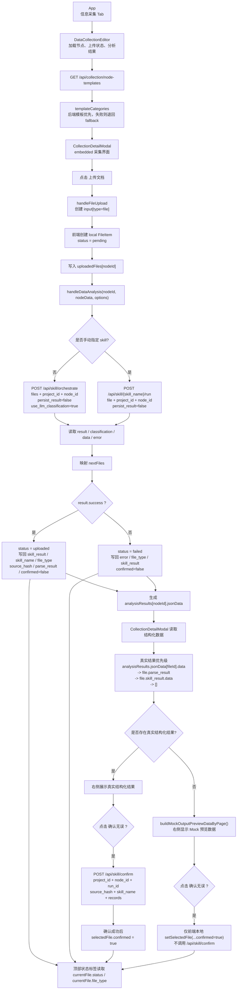

# 当前前端数据提取链路流程图

## 主流程图

## 图例

- `uploadedFiles`
  - 以 `nodeId` 为键保存当前节点下的文件列表。
  - 每个文件项包含 `status`、`error`、`skill_result`、`parse_result`、`file_type`、`confirmed` 等字段。

- `analysisResults`
  - 以 `nodeId` 为键保存整理后的结构化结果。
  - 右侧“输出数据预览”优先读取这里，而不是直接使用接口原始返回。

- `status`
  - 上传后先是 `pending`。
  - 接口返回后在前端被改成 `uploaded` 或 `failed`。
  - 顶部状态标签主要看这个字段，不看 `confirmed`。

- `file_type`
  - 自动编排时来自 `classification.file_type`。
  - 会显示在右侧输出头部，比如 `other`、识别后的业务类型等。

- `confirmed`
  - 表示用户是否做了“确认无误”动作。
  - 它和 `status` 独立。
  - 在 mock 预览场景下，点击确认只会改前端本地 `confirmed=true`，不会触发后端保存。

- 结构化数据优先级
  - `analysisResults.jsonData[fileId].data`
  - `file.parse_result`
  - `file.skill_result.data`
  - `[]`

## 场景覆盖检查

1. 页面初始化加载模板
2. 上传后自动编排
3. 手动指定 skill 执行
4. Mock 预览下点击确认

## 对应代码入口

- `src/app/App.tsx`
- `src/app/components/data-collection-editor.tsx`
- `src/app/components/collection-detail-modal.tsx`
